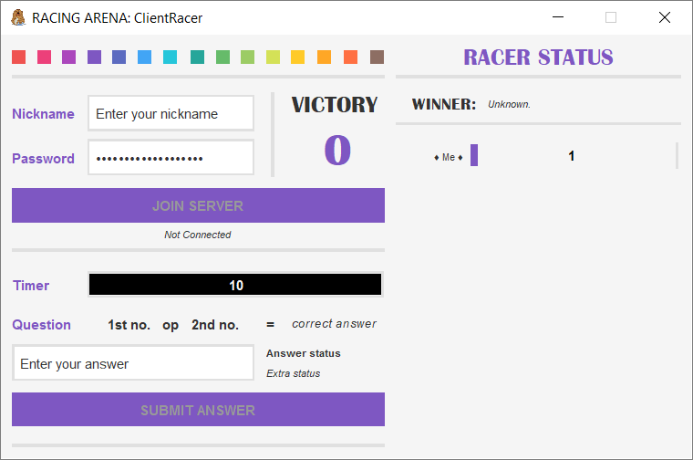
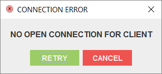
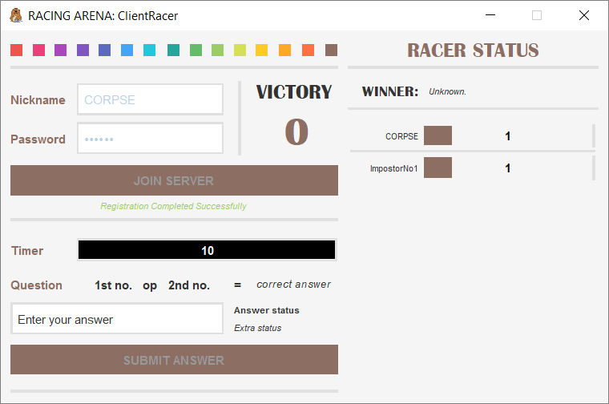
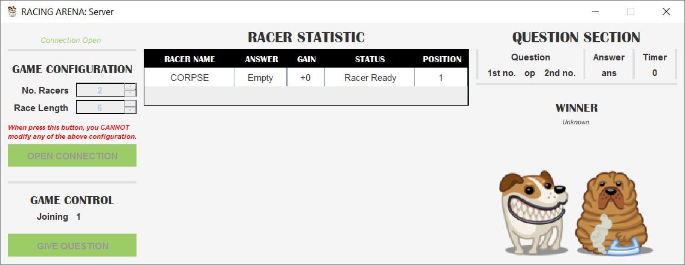
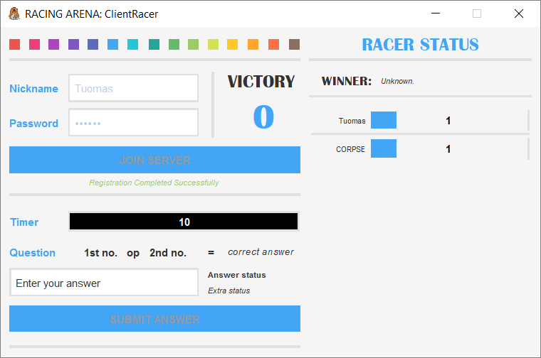
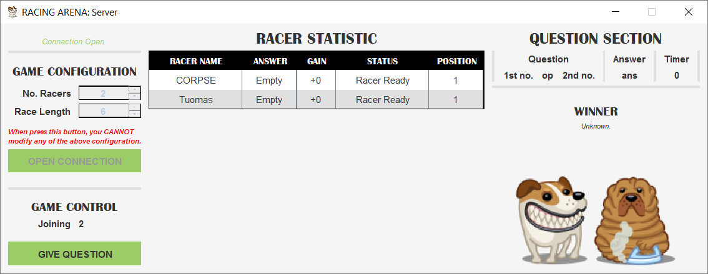

# racing-arena
CS494: Socket Programming

**NAMES**:
* Trần Thị Anh Thư - 1751036
* Lê Phạm Ngọc Yến - 1751028

**REQUIREMENT INSTALL**: 
* H2 database: https://www.h2database.com/html/main.html

**ASSETS**: https://www.iconarchive.com/show/tailwaggers-icons-by-iconka.html

**CODE REFERENCES**:
* Timer with Progress Bar:  
https://stackoverflow.com/questions/5931933/how-to-make-timer-countdown-along-with-progress-bar  
https://stackoverflow.com/questions/18124276/java-making-the-code-wait-until-swing-timer-finished-work
* Popup error message:  
https://docs.oracle.com/javase/tutorial/uiswing/components/dialog.html
* Bring output stream from system to JTextArea:  
https://stackoverflow.com/questions/13893655/java-redirecting-system-out-println-to-a-jlabel/13893719
* Allow to press [Enter] to submit answer:  
https://stackoverflow.com/questions/13731710/allowing-the-enter-key-to-press-the-submit-button-as-opposed-to-only-using-mo
* Socket non-blocking programming:  
https://vovanhai.wordpress.com/java/l%E1%BA%ADp-trinh-java-nang-cao/networking/chatroom-d%C6%A1n-gi%E1%BA%A3n/

**APPLICATION SNIPPET**:

* Server GUI: 

* Client GUI: 

* Error Message: 

  
  
  
  

